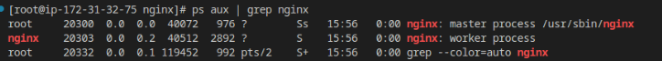
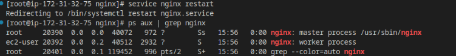
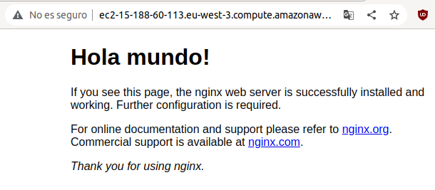
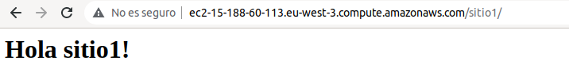

# PROYECTO AWS
###### Nerea Pascual García

## Creación de instancia en AWS

Desde la página de AWS lanzaremos una instancia dentro de la consola de EC2. 
Esta tendrá como nombre *nginx*. Además, crearemos un key pair al que nombraremos *aisr22* y activaremos las opciones de permitir tráfico http y https desde internet.
Creamos la instancia con estas configuraciones realizadas.

## Conexión con la instancia

Seleccionamos la instancia y seleccionamos en Conectar.
Nos vamos al apartado de Cliente SSH.

Con esto, abrimos un terminal para trabajar en él.
Modificamos los permisos de asir22.pem con el siguiente comando:

> chmod 400 asir22.pem

Copiamos el comando que nos aparece como ejemplo en la web de AWS al ir al apartado de Cliente SSH, este es el siguiente:

> ssh -i "asir22.pem" ec2-user@ec2-15-188-60-113.eu-west-3.compute.amazonaws.com

Instalamos nginx desde la consola:
> sudo amazon-linux-extras list | grep nginx
> sudo amazon-linux-extras enable nginx1
> sudo yum clean metadata
> sudo yum -y install nginx
> sudo su -
> systemctl enable nginx
> systemctl start nginx

## Comprobación del funcionamiento de nginx

Usamos el siguiente comando en la consola:

> systemctl status nginx

Nos tendrá que aparece en estado ACTIVE para comprobar que nginx está funcionando.

Además, abrimos el navegador e introduciremos lo siguiente:

> ec2-15-188-60-113.eu-west-3.compute.amazonaws.com

Nos aparecerá "Welcome to nginx!".

(Este lo sacaremos también de la página de AWS en el apartado de Cliente SSH)

Salimos de la terminal con:

> exit

Y probamos a entrar con la ruta absoluta de asir22.pem. En mi caso:

> ssh -i "/home/asir2a/Escritorio/SRI/AWS/asir22.pem" ec2-user@ec2-15-188-60-113.eu-west-3.compute.amazonaws.com

## Conexión con Visual Studio Code

Lo primero será instalar la extensión llamada **Remote - SSH**.

Pulsaremos F1 y buscaremos la opción *Remote-SSH: Add New SSH Host*.
Introducimos el comando con el que nos conectamos anteriormente con la ruta absoluta:

> ssh -i "/home/asir2a/Escritorio/SRI/AWS/asir22.pem" ec2-user@ec2-15-188-60-113.eu-west-3.compute.amazonaws.com

Elegiremos el archivo de configuración que nos aparece como predeterminado: */home/asir2a/.ssh/config*.

Volvemos a pulsar F1 y esta vez buscaremos la opción *Remote-SSH: Connect to Host*. 

Seleccionamos el ec2 y se abrirá una nueva ventana de Code para el ec2.
Una vez abramos una terminal, ya nos encontraremos dentro del ssh.

Si buscamos en el navegador  lo siguiente nos mostrará que estamos conectados a nginx.

> ec2-15-188-60-113.eu-west-3.compute.amazonaws.com

## Configuración de ssh para entrar como root

Con la instancia levantada abriremos una terminal.

Nos introducimos en ssh con el comando:

> ssh -i "asir22.pem" ec2-user@ec2-15-188-60-113.eu-west-3.compute.amazonaws.com

Entramos como superusuario:

> sudo su -

Y entraremos en el fichero de configuración de ssh para modificarlo:

> nano /etc/ssh/sshd_config 

En este, cambiaremos la linea de PermitRootLogin y pondremos: *PermitRootLogin without-password*.

Reiniciamos el servicio de ssh:

> service sshd restart

Salimos de ssh con:

> exit

Entramos como superusuario:

> sudo su -

Modificamos el siguiente fichero:

> nano .ssh/authorized_keys

Borramos todo lo anterior a ssh-rsa en el fichero.

Salimos con 2 veces:

> exit

Entramos como root con el siguiente comando para comprobar que funciona:

> ssh -i "/home/asir2a/Escritorio/SRI/AWS/asir22.pem" root@ec2-15-188-60-113.eu-west-3.compute.amazonaws.com

Abrimos Code. Pulsamos F1 y buscamos la opción *Remote-SSH. Add new SSH host*, con el comando anterior *ssh -i "/home/asir2a/Escritorio/SRI/AWS/asir22.pem" root@ec2-15-188-60-113.eu-west-3.compute.amazonaws.com* y con el fichero de configuración por defecto */home/asir2a/.ssh/config*.

En el fichero de configuración cambiaremos los nombres a los host para diferenciarlos fácilmente. En el ec2-user lo nombramos como ec2 y en el root como root.

Si ahora abrimos un terminal e introducimos lo siguiente deberíamos poder introducirnos en la terminal del root:

> ssh root

## Área de trabajo en root

Con F1 y buscando *Remote-SSH: Connect to host* y eligiendo root nos abrirá una nueva ventana de Code para el root.

En Explorer seleccionamos la opción Open Folder para abrir una carpeta sobre la que queremos trabajar. Elegimos el siguiente directorio: */etc/nginx*.

En una terminal introducimos el comando:

> ps aux | grep nginx 

Nos mostrará lo siguiente:

Abrimos el fichero **nginx.conf** y cambiamos el user a ec2-user.
Reiniciamos el servicio desde el terminal introduciendo el comando:

> service nginx restart

Esta vez al hacer el comando anterior nos mostrará lo siguiente:

Nos vamos a la opción File en el menú superior de Code y elegimos *Save Workspace As* para crear un área de trabajo con varios directorios.

Luego seleccionamos la opción *Add Folder to Workspace* y añadimos al ruta */var/log/nginx* y la ruta */usr/share/nginx/html*.
Con esto, podremos trabajar sobre varios directorios a la vez.

Además, modificaremos el **index.html** que se encuentra dentro de la carpeta html de la última ruta introducida.

Cambiaremos la línea "Welcome to nginx!" y escribiremos "Hola mundo!".

Al volver a cargar la página de nginx en el navegador nos aparecerá el nuevo texto.

## Páginas web

Dentro de la carpeta nginx y posteriormente de la subcarpeta conf.d crearemos el fichero llamado **server1.conf**.

Introducimos los siguiente:

~~~
server {

    location /sitio1 { 
    alias /home/ec2-user/sitios/sitio1;
    }

    location /sitio2 { 
    alias /home/ec2-user/sitios/sitio2;
    }

}
~~~

Nos conectamos con F1, *Remote-SSH: Connect to Host* a ec2.
Abriremos la carpeta /home/ec2-user y creremos dos carpetas en esta ubicación.
La primera llamada **html** y otra llamada **sitios**. En esta última crearemos dos subcarpetas llamadas **sitio1** y **sitio2**.
Dentro de cada carpeta creamos un html. 

En sitio1 creamos el fichero index.html con lo siguiente:

~~~
<h1>Hola sitio1!</h1>
~~~

Y en sitio2 creamos el fichero index.html con lo siguiente:

~~~
<h1>Hola sitio2!</h1>
~~~

Reiniciamos el servicio de nginx con:

> service nginx.service

Buscamos en el navegador lo siguiente:

En el caso del sitio1:

> http://ec2-15-188-60-113.eu-west-3.compute.amazonaws.com/sitio1

Comprobación del funcionamiento:

En el caso del sitio2:

> http://ec2-15-188-60-113.eu-west-3.compute.amazonaws.com/sitio2

Comprobación del funcionamiento:

